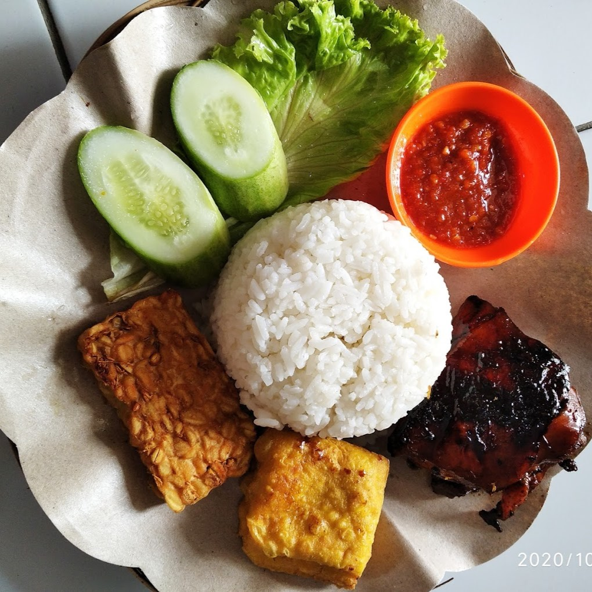

<!-- LOGO -->
<br />
<div align="center">
  <a href="https://github.com/Sister20/tugas-besar-if3130-jaringan-komputer-risma/tree/main">
    
  </a>

<h3 align="center">RISMA</h3>

  <p align="center">
    Tugas Besar 1
    <br />    
    IF3130 Jaringan Komputer
    <br />
  </p>
</div>

<!-- TABLE OF CONTENTS -->
<details>
  <summary>Table of Contents</summary>
  <ol>
    <li>
        <a href="#about-the-project">About The Project</a>
        <ul>
            <li><a href="#specification">Features</a></li>
            <li><a href="#built-with">Built With</a></li>
            <li><a href="#project-structure">Project Structure</a></li>
        </ul>
    </li>
    <li>
        <a href="#getting-started">Getting Started</a>
        <ul>
            <li><a href="#prerequisites">Prerequisites</a></li>
            <li><a href="#installation">Installation</a></li>
        </ul>
    </li>
    <li>
        <a href="#usage">Usage</a>
    </li>
    <li>
        <a href="#authors">Author</a>
    </li>
  </ol>
</details>
<br/>
<br/>

<!-- ABOUT THE PROJECT -->
## About The Project

Tubes 1 Jaringan Komputer (IF3130). Sistem program server-client.

### Features

* UDP Protocol
* Three way handshake
* Checksum
* File transfer (any extension)
* ARQ Go-Back-N Mechanism
* Unreliable connection handling mechanism (Segment loss, Bit loss, etc)
* Peer to peer <strong>[Bonus]</strong>
* Parallel mode <strong>[Bonus]</strong>
* End to End <strong>[Bonus]</strong>
* Tic Tac Toe <strong>[Bonus]</strong>

### Built With

* 

### Project Structure
```ssh
.
├─── .gitignore
├─── client.py
├─── penerima.py
├─── pengirim.py
├─── README.md
├─── server.py
├─── input
│    ├── TC2.rar
│    ├── TC4.rar
│    └── tes.pdf
├─── lib
│    ├── connection.py
│    ├── messageInfo.py
│    ├── segment.py
│    └── utils
│        ├── Colors.py
│        └── logger.py
└─── tictactoe
     ├── player.py
     ├── tictactoe.py
     └── lib
         ├── Board.py
         ├── Client.py
         ├── Connection.py
         ├── Display.py
         ├── Evaluator.py
         ├── GameClient.py
         ├── GameServer.py
         ├── MessageInfo.py
         ├── Player.py
         ├── Segment.py
         └── Server.py
```
<br/>
<br/>

<!-- GETTING STARTED -->
## Getting Started

### Prerequisites
* Python 3.10+

### Installation
1. Clone the repo
   ```sh
   git clone https://github.com/Sister20/tugas-besar-if3130-jaringan-komputer-risma.git
   ```
<br/>
<br/>

<!-- USAGE -->
## Usage

### Starting the server
1. Go to the repository root folder `tugas-besar-if3130-jaringan-komputer-risma`
    ```sh
    cd tugas-besar-if3130-jaringan-komputer-risma
    ```
2. Run the server `server.py`
    ```sh
    python server.py <server_port> <input_file>
    ```
3. Choose whether to enable parallel mode or not
    ```sh
    Enable parallel? (y/n) y

    [•] Server running on port 12345

    [•] Starting server in parallel mode...
    ```

### Starting the client
1. Go to the repository root folder `tugas-besar-if3130-jaringan-komputer-risma`
    ```sh
    cd tugas-besar-if3130-jaringan-komputer-risma
    ```
2. Run the client `client.py`
    ```sh
    python server.py <client_port> <server_port> <output_file>
    ```
3. Run another client with different port if necessary
    ```sh
    python server.py <another_client_port> <server_port> <another_output_file>
    ```

### Starting using main.py
1. Go to the repository root folder `tugas-besar-if3130-jaringan-komputer-risma`
    ```sh
    cd tugas-besar-if3130-jaringan-komputer-risma
    ```
2. Run the main program `main.py`
    ```sh
    python main.py
    ```

### Tic Tac Toe
1. Go to the tictactoe folder `tugas-besar-if3130-jaringan-komputer-risma/tictactoe`
    ```sh
    cd tugas-besar-if3130-jaringan-komputer-risma/tictactoe
    ```
2. Run the server `server.py`
    ```sh
    python tictactoe.py <server_port>
    ```
3. Run player 1 as client `player.py`
    ```sh
    python player.py <client_port_1> <server_port>
    ```
4. Run player 2 as client `player.py`
    ```sh
    python player.py <client_port_2> <server_port>
    ```

<br/>
<br/>


<!-- AUTHOR -->

## Authors

|   NIM    |          Name          |
|:--------:|:----------------------:|
| 13521005 | Kelvin Rayhan Alkarim  |  
| 13521019 |   Ditra Rizqa Amadia   |
| 13521021 |   Bernardus Willson    |
